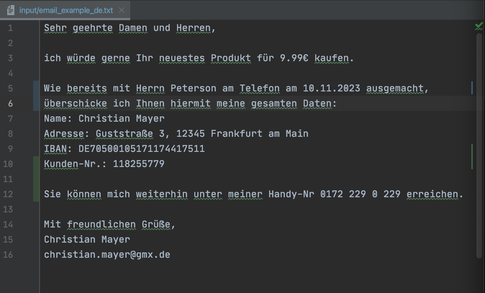

# AI-Name-Entity-Recognizer (AI-NER): Text Editing with Language Models


This repository is designed for editing input text using a Language Model.
It allows users to apply various editing prompts and various models defined in configuration files to modify the input text.

Currently, the editing prompts are written to recognize and replace name entities such as names or locations from free text
and replaces all occurrences with a placeholder defined in the prompt config file.

This project aims to stay model agnostic (i.e. it can be used with a model of the user's choice) and therefore avoid any vendor lock-in. 

This software functions in a way like a smart editor.
E.g. it can anonymize names in a text or exchange name entities for a batch of emails.

## Table of Contents

- [Installation](#Installation)
- [Configuration](#Configuration)
- [Usage](#Usage)
- [Example](#Example)
- [License](#license)

## Installation

To use the AI-NER, follow these steps:

1. Clone the repository:
```bash
git clone https://github.com/jWinman91/ai-extractor.git
cd ai-extractor
```
2. Install the required dependencies:
```bash
pip install -r requirements.txt
```

3. Download a model of your choice into `models`. I recommend the following models from [Hugging Face](https://huggingface.co/) for German text:
   a. [flair/ner-german-large](https://huggingface.co/flair/ner-german-large)
   b. [roberta-large-NER](https://huggingface.co/51la5/roberta-large-NER)
   c. [sauerkraut-7b](https://huggingface.co/TheBloke/SauerkrautLM-7B-v1-mistral-GGUF).
   Each model can be downloaded by using wget, e.g.:
   ```wget https://huggingface.co/TheBloke/SauerkrautLM-7B-v1-mistral-GGUF/resolve/main/sauerkrautlm-7b-v1-mistral.Q4_0.gguf```

## Configuration

In order to use this repository, several configuration need to be set for the model as well as the NER tasks to extract name entities.
These can be set in two types of configuration files, `config_model` and `config_prompt`.

- `config_model` sets all configurations necessary for the respective model.
- `config_prompt`sets the configurations for the NER tasks (e.g. which model to choose and with what to replace the identified name entity).

**TODO**

## Usage

After setting the configuration and downloading one (or more) of the models, you can simply use AI-NER by running:

```bash
python main.py $PATH_TO_INPUT $PATH_TO_OUTPUT
```

## Example

An example text file is added in `data/input/email_example_de.txt`, which is a self-written email in German.
There are also pre-defined `config_model` and `config_prompt` files.
By running AI-NER with the `anonymize_example_email.yaml` prompt configuration and `german_mistral.yaml` as well as the `flair.yaml` model configuration,
we can now anonymize certain entities in the example email.

Below are an image of before and after running `python main.py` on the email using the `anonymize_emails-NER.yaml` config file.

<div style="display: flex; justify-content: space-between;">
  
  
</div>

## License

This project is licensed under the MIT License - see the [LICENSE](LICENSE) file for details.

## Acknowledgments

- [NLTK](https://www.nltk.org/) - Natural Language Toolkit used for sentence tokenization.
- [Hugging Face](https://huggingface.co/) - Framework for working with state-of-the-art natural language processing models.
