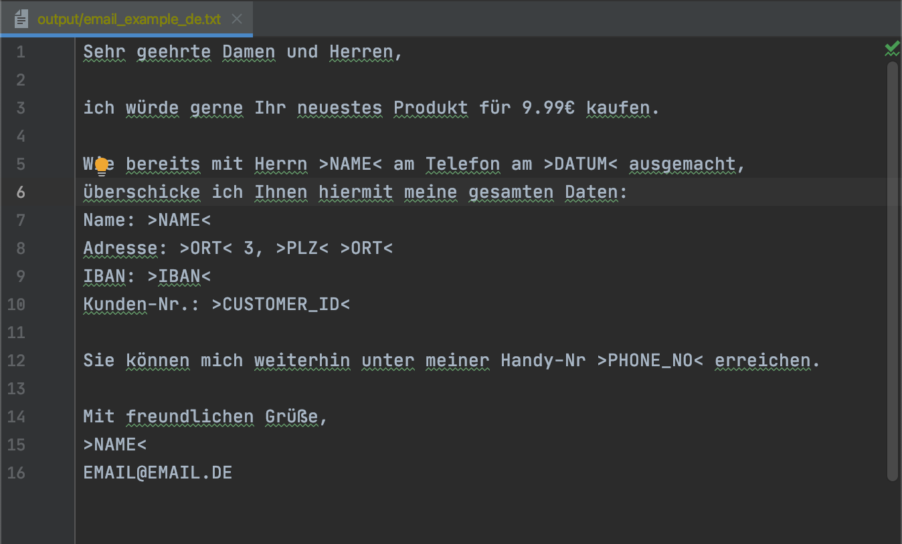

# AI-Name-Entity-Recognizer (AI-NER): Text Editing with Language Models


This repository is designed for editing input text using a Language Model.
It allows users to apply various editing prompts and various models defined in configuration files to modify the input text.

Currently, the editing prompts are written to recognize and replace name entities such as names or locations from free text
and replaces all occurrences with a placeholder defined in the prompt config file.

This project aims to stay model agnostic (i.e. it can be used with a model of the user's choice) and therefore avoid any vendor lock-in. 

This software functions in a way like a smart editor.
E.g. it can anonymize names in a text or exchange name entities for a batch of emails.

## Table of Contents

- [Installation](#Installation)
- [Configuration](#Configuration)
- [Usage](#Usage)
- [Example](#Example)
- [License](#license)

## Installation

To use the AI-NER , follow these steps:

1. Clone the repository:
```bash
git clone https://github.com/jWinman91/ai-extractor.git
cd ai-extractor
```
2. Install the required dependencies:
```bash
pip install -r requirements.txt
```

3. Optional: Download a model of your choice into `model`

## Configuration

In order to use this repository, several configuration need to be set.

**TODO**

## Usage

You can simply use AI-NER by running:

````bash
python main.py $PATH_TO_INPUT $PATH_TO_OUTPUT
````

**TODO**

## Example

An example text file is added in `data/input/email_example_de.txt`, which is a self-written email in German.
By applying AI-NER to this file, we can now anonymize all names and locations in this email.

Below are an image of before and after running `python main.py` on the email using the `anonymize_emails-NER.yaml` config file.

<div style="display: flex; justify-content: space-between;">
  
  
</div>

## License

This project is licensed under the MIT License - see the [LICENSE](LICENSE) file for details.

## Acknowledgments

- [NLTK](https://www.nltk.org/) - Natural Language Toolkit used for sentence tokenization.
- [Hugging Face](https://huggingface.co/) - Framework for working with state-of-the-art natural language processing models.
